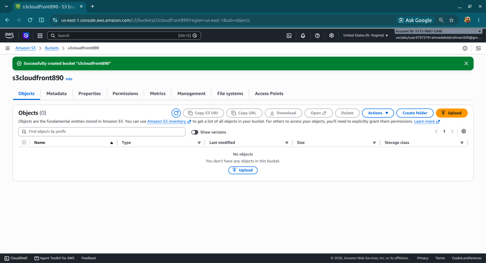
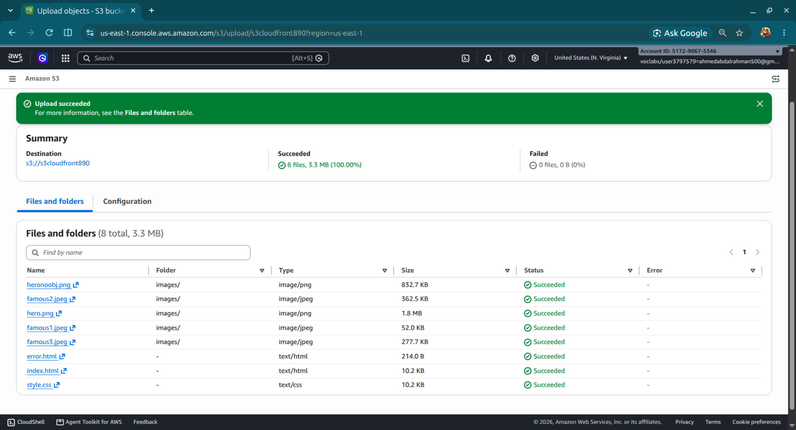
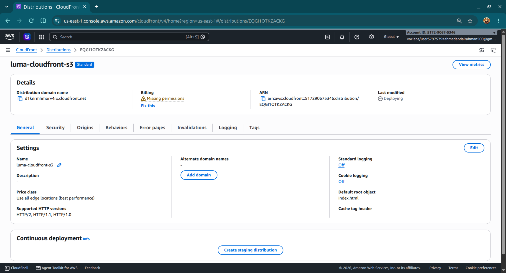
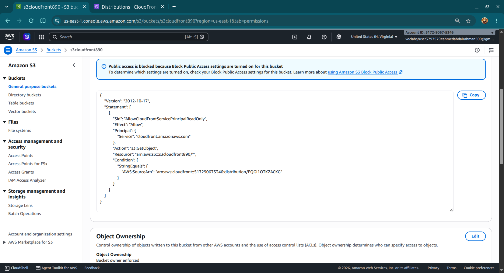
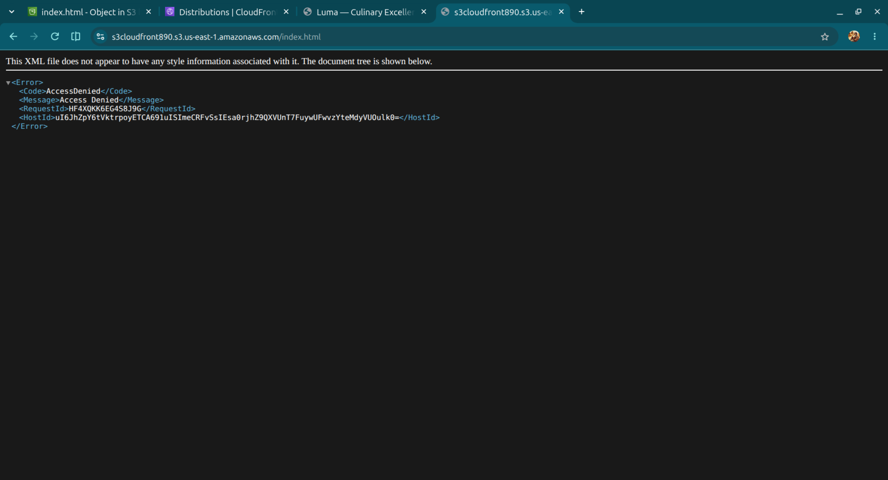
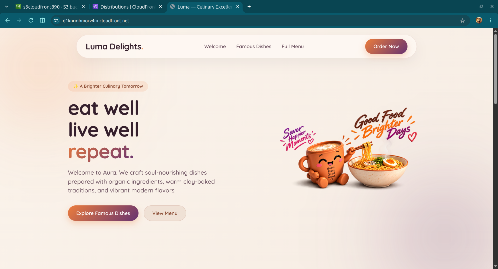
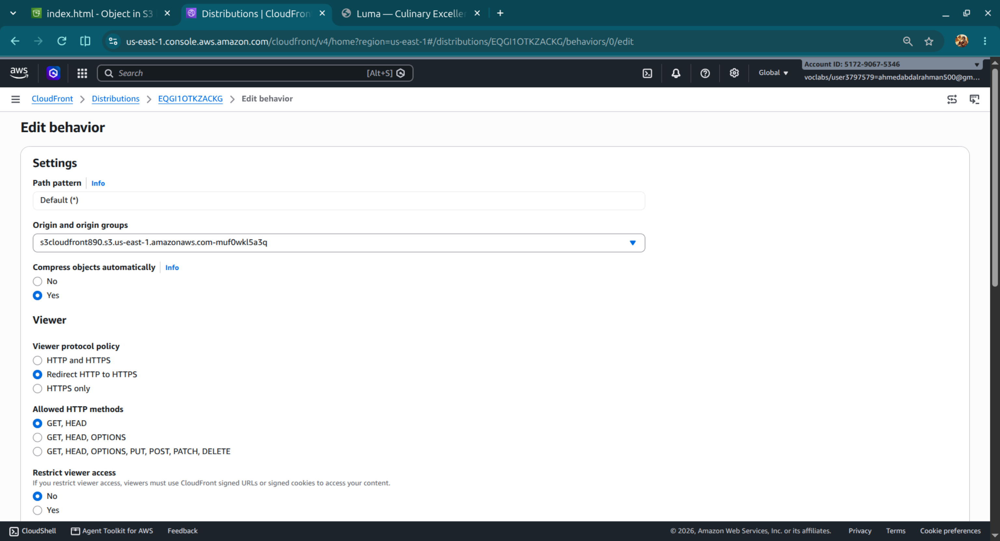
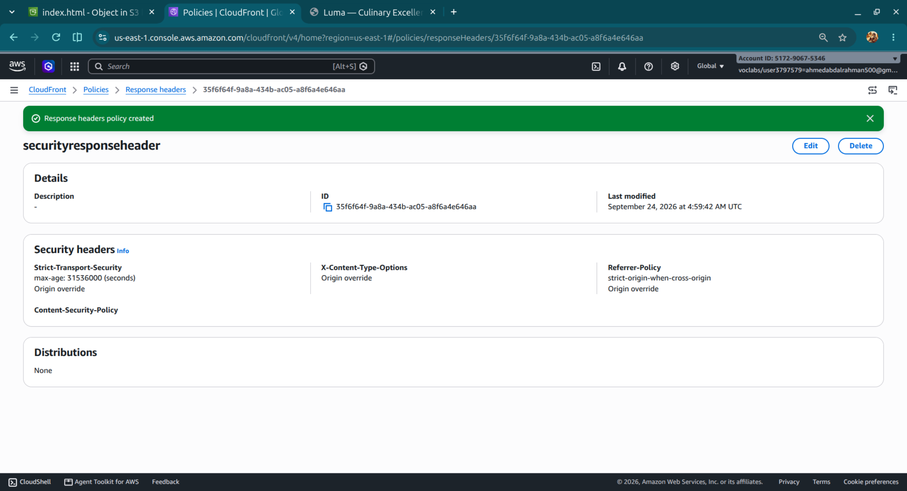
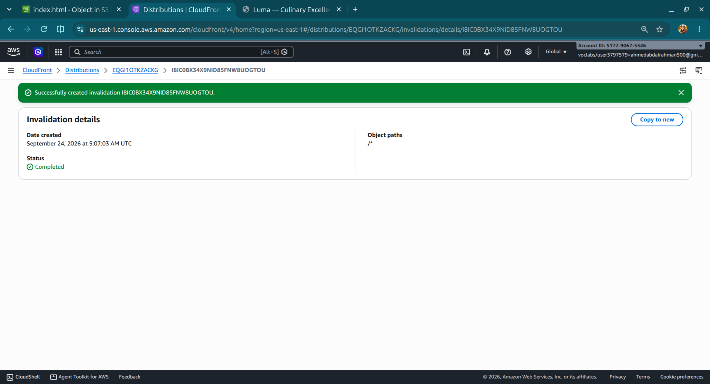

# Secure Static Website Delivery with Amazon CloudFront & S3

## Website

**Luma — Culinary Excellence**

A responsive static restaurant website built with HTML and CSS and delivered through the CloudFront distribution.

This project demonstrates secure static website delivery using a **private Amazon S3 origin** and **Amazon CloudFront** as the public delivery layer.

## Architecture

```text
                         Users
                           |
                         HTTPS
                           |
                           v
                 +-------------------+
                 |    CloudFront     |
                 |-------------------|
                 | Edge caching      |
                 | HTTPS redirect    |
                 | Compression       |
                 | Security headers  |
                 | Cache invalidation|
                 +---------+---------+
                           |
                     Origin Access
                       Control
                           |
                           v
                 +-------------------+
                 |    Amazon S3      |
                 |-------------------|
                 | Private bucket    |
                 | Block Public      |
                 | Access enabled    |
                 +-------------------+
```

**Traffic flow:** Users access the website through CloudFront. CloudFront retrieves objects from the S3 origin using Origin Access Control (OAC), while direct public access to the S3 objects remains denied.

## Objectives

- Deliver a static website through Amazon CloudFront.
- Keep the S3 origin private instead of exposing it directly to the internet.
- Use CloudFront OAC to authorize access to S3.
- Enforce HTTPS for viewer requests.
- Improve delivery efficiency through edge caching and automatic compression.
- Add security response headers at the CDN layer.
- Demonstrate cache invalidation when website content changes.
- Verify the difference between direct S3 access and CloudFront delivery.

## AWS Services Used

| Service | Purpose |
|---|---|
| **Amazon S3** | Private origin for website files |
| **Amazon CloudFront** | CDN and public delivery layer |
| **CloudFront Origin Access Control (OAC)** | Secure CloudFront-to-S3 authorization |
| **S3 Bucket Policy** | Restrict object access to the CloudFront distribution |
| **CloudFront Response Headers Policy** | Add browser security headers |

## Implementation

### 1. Private S3 Origin

Created an S3 bucket and uploaded the static website files.

S3 was kept private with **Block Public Access enabled**. The bucket is used as the CloudFront origin rather than the S3 static website endpoint.





### 2. CloudFront Distribution

Created a CloudFront distribution with the S3 bucket configured as the origin.

The distribution acts as the public entry point and provides edge-based content delivery.



### 3. Origin Access Control

Configured CloudFront to access the private S3 origin using **Origin Access Control (OAC)**.

The associated S3 bucket policy grants the CloudFront distribution permission to retrieve objects with `s3:GetObject`.



### 4. Private-Origin Verification

Tested the S3 REST endpoint directly. The request returned **AccessDenied**, confirming that the website objects are not publicly readable through the S3 endpoint.



The same website is successfully delivered through the CloudFront distribution:



### 5. HTTPS Enforcement

Configured the CloudFront viewer protocol policy to redirect HTTP requests to HTTPS.

```text
HTTP request
     |
     v
CloudFront
     |
     +----> Redirect to HTTPS
```

This ensures viewers use encrypted connections to the CDN.

### 6. Edge Caching and Compression

Used the recommended S3-oriented CloudFront cache configuration and enabled automatic object compression.

CloudFront can serve cached objects from edge locations instead of requesting every object from S3.



### 7. Response Security Headers

Created and attached a CloudFront response headers policy containing:

- `Strict-Transport-Security`
- `X-Content-Type-Options: nosniff`
- `Referrer-Policy: strict-origin-when-cross-origin`

These headers add browser-side security controls at the CDN layer.



### 8. Cache Invalidation

Implemented CloudFront cache invalidation using:

```text
/*
```

This allows updated website content to be served without waiting for previously cached objects to expire.



## Validation

The deployment was validated through the following checks:

| Test | Result |
|---|---|
| Website served through CloudFront | ✅ |
| Direct S3 object access | ❌ AccessDenied |
| Private S3 origin | ✅ |
| CloudFront OAC | ✅ |
| HTTPS redirect | ✅ |
| Automatic compression | ✅ |
| Response security headers | ✅ |
| Cache invalidation | ✅ |

