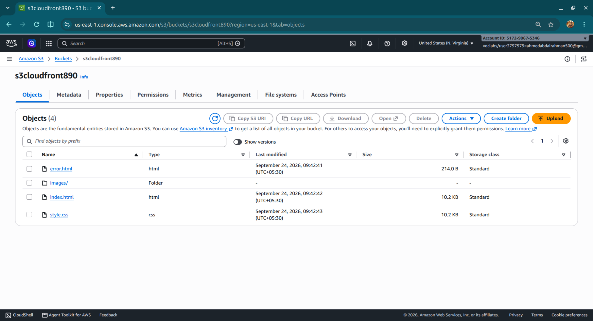

created s3 bucket and uploaded the website files

created cloudfont dist

update the bucket policy to allow cloudfront to access the object getobject

access the website through cloudfront domain name 

notive that the bucket is private and can not be accessed from the internet directly 

make sure the distribution automatically compress the objects before delivering them to the users 

create a response header security policy and update it with the default cache behaviour

implemented cache invalidation

---
Configured CloudFront Viewer Protocol Policy to redirect HTTP requests to HTTPS.